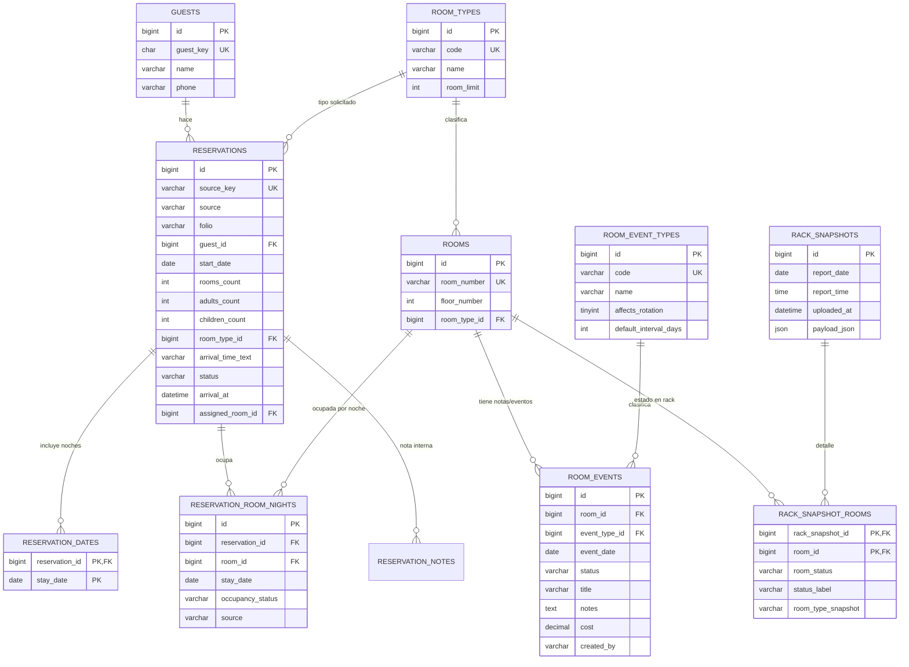

# Esquema MySQL propuesto — Hotel Villa Margaritas

Estado: propuesta local para visto bueno. No está commiteado ni desplegado.

## ¿Está normalizada?

Sí, la parte operativa principal está normalizada:

- El huésped vive en `guests`.
- La reserva vive en `reservations`.
- Las noches de la reserva viven en `reservation_dates`.
- La ocupación real por cuarto y por noche vive en `reservation_room_nights`.
- Los tipos de cuarto viven en `room_types`.
- Los cuartos físicos viven en `rooms`.
- Las notas/mantenimiento de cuartos viven en `room_events`.
- Los tipos de eventos viven en `room_event_types`.
- Las notas internas de reserva viven en `reservation_notes`.

Hay dos campos JSON intencionales:

- `rack_snapshots.payload_json`: conserva el rack completo original para auditoría.
- `quotations.sections_json`: conserva las secciones flexibles de cotizaciones.

También se normaliza el rack en `rack_snapshot_rooms`, así que el JSON no es la única fuente para reportes.

## Diagrama ERD

## Flujo operativo

1. Una reserva se guarda en `reservations`.
2. Sus fechas se guardan en `reservation_dates`.
3. Cuando se asigna habitación en llegada, se llenan las noches reales en `reservation_room_nights`.
4. Cada rack importado crea `rack_snapshots` y `rack_snapshot_rooms`.
5. Limpiezas profundas, mantenimiento, climas y notas de cuarto se guardan en `room_events`.

La diferencia clave es esta:

- `reservation_dates` responde: “¿qué días cubre la reserva?”
- `reservation_room_nights` responde: “¿qué cuarto exacto estuvo ocupado cada noche?”

## Reportes incluidos como vistas SQL

### `report_daily_occupancy`

Ocupación diaria real:

- fecha
- cuartos ocupados
- room nights ocupados
- porcentaje de ocupación

Sirve para ver ocupación del día y tendencia por fecha.

### `report_monthly_room_rotation`

Rotación mensual por habitación:

- mes
- habitación
- tipo
- noches ocupadas
- última fecha ocupada
- última limpieza profunda
- último mantenimiento de clima
- último mantenimiento general

Sirve para decidir qué habitaciones rotar, descansar o revisar.

### `report_room_service_due`

Habitaciones que podrían requerir atención:

- días desde limpieza profunda
- días desde mantenimiento de clima
- noches ocupadas en últimos 30 días

Sirve para priorizar limpieza profunda y mantenimiento.

### `report_reservations_by_source_month`

Reservas por fuente:

- manual
- excel
- bot

Sirve para saber de dónde vienen las reservas y cuántas habitaciones generan.

### `report_today_occupancy`

Estado de ocupación de hoy por habitación:

- habitación
- tipo
- libre/ocupada
- folio
- huésped
- llegada registrada

Sirve para recepción y operación diaria.

## Reportes recomendados para dashboard

Ya se agregó una pestaña `Reportes` al dashboard con:

1. Ocupación del día
   - ocupadas
   - libres
   - pendientes de llegada
   - retrasadas

2. Rotación mensual por habitación
   - tabla por cuarto con noches ocupadas
   - ordenar de más usada a menos usada
   - sugerencia: usar primero las menos ocupadas

3. Mantenimiento pendiente
   - cuartos con más de X días sin limpieza profunda
   - cuartos con más de X días sin mantenimiento de clima
   - cuartos con muchas noches ocupadas seguidas

4. Historial de habitación
   - reservas asociadas
   - limpiezas profundas
   - mantenimientos
   - notas
   - estados de rack

5. Reporte mensual general
   - ocupación promedio
   - noches vendidas
   - habitaciones más usadas
   - habitaciones menos usadas
   - reservas por fuente

Mientras MySQL no esté activo, la pestaña funciona en modo parcial:

- Ocupación por fecha se calcula con las reservas disponibles.
- Rack/estado de habitaciones se toma del último rack guardado.
- El histórico exacto por habitación, limpiezas y mantenimientos se activa al usar MySQL.

## Catálogo inicial de eventos de habitación

La base se siembra con:

- `DEEP_CLEAN`: Limpieza profunda, cada 30 días sugerido.
- `MAINTENANCE`: Mantenimiento general, cada 90 días sugerido.
- `AC_MAINTENANCE`: Mantenimiento de clima, cada 90 días sugerido.
- `PAINT`: Pintura / retoque, cada 180 días sugerido.
- `OBSERVATION`: Nota de habitación, sin intervalo.

Estos intervalos se pueden cambiar después desde catálogo.
